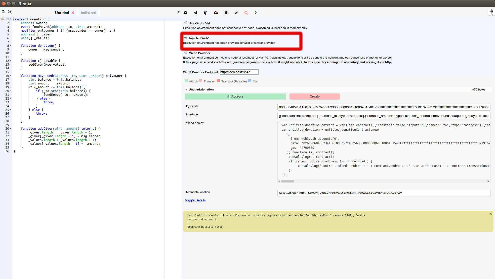
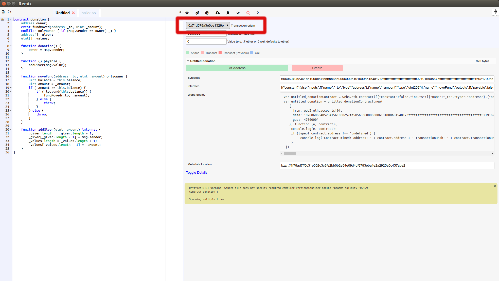
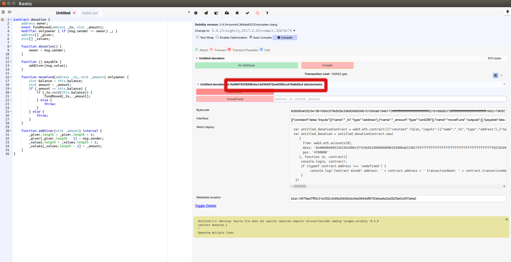
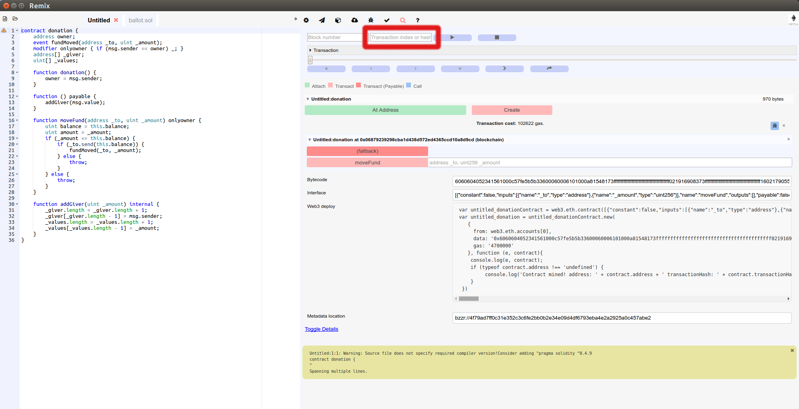

Debugging a Dapp using Remix - Mist - Geth
==========================================

The ultimate goal of this tutorial is to debug transactions that have
been created by a dapp front end.

It is easy in Remix to debug a transaction created from its own GUI.
However, setting up an environment that allows you to debug transactions
created outside of Remix, require a bit more of complexity.

We will need four tools for that :

> -   Geth - this is the center piece and provides the blockchain
>     environment. We will basically run geth in a dev mode.
> -   Mist - this is the Ethereum dapp browser. We will use it to browse
>     our front end.
> -   Remix - this is the Ethereum IDE. We will use it to develop our
>     Solidity contract.
> -   Any code editor you want - in order to write your front end :)

Install the environment
-----------------------

### Install Mist

Mist is the Ethereum browser and the entry point of a Dapp.

Please download [the latest
version](http://github.com/ethereum/mist/releases) (at least 0.8.9).

Basically we will always run our front end in Mist (note that it is also
possible to use [Metamask](http://metamask.io)).

### Install Geth

[Geth](http://github.com/ethereum/go-ethereum/releases) is the official
Ethereum client.

Running the environment
-----------------------

### Run Geth

We will run a test node. This node will have a new empty state and will
not be synced to the main or ropsten network.

    geth --ipcpath <test-chain-directory>/geth.ipc --datadir <test-chain-directory> --dev console

`<test-chain-directory>` is the folder where keys and chain data will be
stored.

`--ipcpath` defines the end point that other apps (like Mist) use to
talk to geth.

`--datadir` specifies the data directory.

`--dev` sets the node into private chain mode and adds some debugging
flags.

Then we need to create accounts and mine a bit to generate some Ether:

    // from the geth console :
    personal.newAccount() // You can execute this command several time if you need more than one account.
    miner.start()  // generate some Ether.
    miner.stop() // stop mining after 30s-60s - we could also keep mining.

Next time we run Geth, we will only need to mine transactions (no need
to recreate account).

### Run Mist

If we run Mist without any argument, its internal Geth node will run. As
we have our own we need to specify the ipc path of the node installed
above.

    mist --rpc <test-chain-directory>/geth.ipc

(yes the option is --rpc)

Once Mist is started, verify that it is connected to the test node
(that's very important!!).

On the bottom left, check that the network is `Private-net` and that the
block number is the same as reported by the test node we are currently
running. Run the following command in the Geth Console to check:
web3.eth.blockNumber.


Clicking on Wallet will allow you to send transactions and check account
balances (if you are currently mining you should see the balance
increasing).

### Starting Remix

In Mist click on `Develop` / `Open Remix IDE`

Remix will open in a new window. If this is the first time it is run,
the `Ballot` contract will be loaded.

Now, we need to check if Remix is connected to Mist:

Right panel / third tab from the left, `Injected Provider` should be
checked.



Right panel / second tab from the left, `Transaction Origin` should
contain accounts we have previously created in Geth.



Developing contract / front end
-------------------------------

### Donation contract - Dapp Back end

Here is a sample solidity contract.

Copy and paste the following inside remix:

``` {.sourceCode .none}
contract Donation {
    address owner;
    event fundMoved(address _to, uint _amount);
    modifier onlyowner { if (msg.sender == owner) _; }
    address[] _giver;
    uint[] _values;

    function Donation() {
        owner = msg.sender;
    }

    function donate() payable {
        addGiver(msg.value);
    }

    function moveFund(address _to, uint _amount) onlyowner {
        uint balance = this.balance;
        uint amount = _amount;
        if (_amount <= this.balance) {
            if (_to.send(this.balance)) {
                fundMoved(_to, _amount);    
            } else {
                throw;
            }
        } else {
            throw;
        }
    }

    function addGiver(uint _amount) internal {
        _giver.push(msg.sender);
        _values.push(_amount);
    }
}
```

### Dapp Front end

and here is the front end:

``` {.sourceCode .none}
<div>    
    <div>Donation Contract</div>
    <br/>
    <input id='contractaddress' placeholder='contract address'></intput>
    <br/>
    <div>
        <br/>
        <input id='fromGive' placeholder='from' ></intput><input placeholder='amount' id='valueGive'></intput><button id="fallbackbtn" onclick="donate()">give</button>
        <br/>
        <br/>
        <input id='fromMoveFund' placeholder='from' ></intput><input id='moveFundTo' placeholder='move to' ></intput><input id='amountToMove' placeholder='amount' ></intput><button id="movefundbtn" onclick="movefund()">moveFund</button>
        <br/>
        <br/>
        <div id='wait' ></div>
    </div>
    <br/>
    <br/>
    <div id='log'>
    </div>
</div>

<script type="text/javascript">
function donate () {
    var donation = contractspec.at(document.getElementById('contractaddress').value)
    donation.donate({
        from: document.getElementById('fromGive').value,
        value: document.getElementById('valueGive').value
    }, function (error, txHash) {       
        tryTillResponse(txHash, function (error, receipt) {
            alert('done ' + txHash)
        })
    })
}

function movefund () {
    var donation = contractspec.at(document.getElementById('contractaddress').value)
    donation.moveFund(
        document.getElementById('moveFundTo').value,
        document.getElementById('amountToMove').value,
        function (error, txHash) {
            tryTillResponse(txHash, function (error, receipt) {
                alert('done ' + txHash)
            })
        })
}

var contractspec = web3.eth.contract([{"constant":false,"inputs":[{"name":"_to","type":"address"},{"name":"_amount","type":"uint256"}],"name":"moveFund","outputs":[],"payable":false,"type":"function"},{"constant":false,"inputs":[],"name":"donate","outputs":[],"payable":true,"type":"function"},{"inputs":[],"payable":false,"type":"constructor"},{"anonymous":false,"inputs":[{"indexed":false,"name":"_to","type":"address"},{"indexed":false,"name":"_amount","type":"uint256"}],"name":"fundMoved","type":"event"}]);

function tryTillResponse (txhash, done) {
    document.getElementById('wait').innerHTML = 'waiting for the transaction to be mined ...'
    web3.eth.getTransactionReceipt(txhash, function (err, result) {
        if (!err && !result) {
            // Try again with a bit of delay
            setTimeout(function () { tryTillResponse(txhash, done) }, 500)
        } else {
            document.getElementById('wait').innerHTML = ''
            var log = document.createElement("div")
            log.innerHTML = JSON.stringify(result)
            document.getElementById('log').appendChild(log)
            done(err,result)
        }
    })
}
</script>
```

I would suggest serving this file using `http-serve`, but you can use
any web server you like.

Example: Dapp Front End <https://github.com/ltfschoen/dapp_front_end>

### Important notice !

The variable `contractspec` contains the abi of the `donation` contract.
This means that if you change something in the contract interface
(function names, parameters, ...) you need to copy the new abi from
remix to the front end.

Deploying
---------

Right panel / Red button `Create`


This creates a new transaction that deploys the `Donation` contract
(Mist will ask for the usual passphrase check).

Wait for the transaction to be mined (don't forget to activate mining
`miner.start()`). Once this is done, you can use it by executing the
`moveFund` and `donate` function. But this is not what we want to
achieve. We want to run and debug those functions from the front end.

Remix also display the address of the contract. Save it, we'll need this
address later.



Debugging
---------

From Mist, browse the above front end. In the first field, paste the
address of the newly created contract. Now, let's call the first
function (label `give`).

You will need an account and a value.

The account could be any account that is declared in the Wallet section
of Mist. This is the sender of the transaction that we are going to
create. The value should be no more than the actual balance of the
account - the unit is in wei, so just put `100` (100 wei), that should
be fine.

Click on `Give` and wait for the transaction to be mined.

The HTML block with id `log` is filled by all the transactions created
from the front end. It was easier for the purpose of this tutorial to
just log transactions in a div but you can have your own logging
mechanism.

There is only one field that we need, this is the `transactionHash`.

Copy it and switch to Remix. On the right side, the fifth panel shows a
small "bug" icon, that is the debugger.

Paste the hash into the transaction field and click on the `play`
button.



You are now entering a debug session for the call to `donate`.

Debugging in Remix is easier than with common tools like gdb because you
can freely move in time. Use the slider to change the current step and
click on the panels below to expand them and explore the curret state,
local variables, etc. There are also breakpoints to move between
sections of the code quickly, but more on all that later.

At the time of this writing, there is an issue that could break the
contract creation. The a workaround for that at
<https://github.com/ethereum/go-ethereum/issues/3653> . Please follow
the workaround or wait for this issue to be closed.

Also, although retrieving a contract's storage when Remix is using the
JavaScript VM is working well, there is still work to be done when Remix
is using eth or geth as backend.
